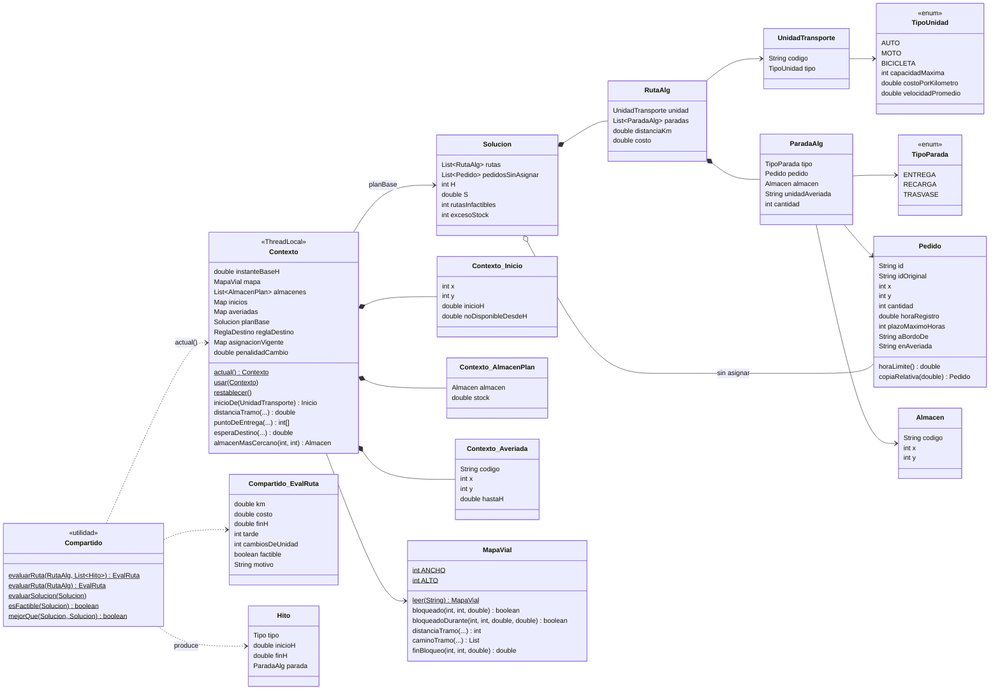
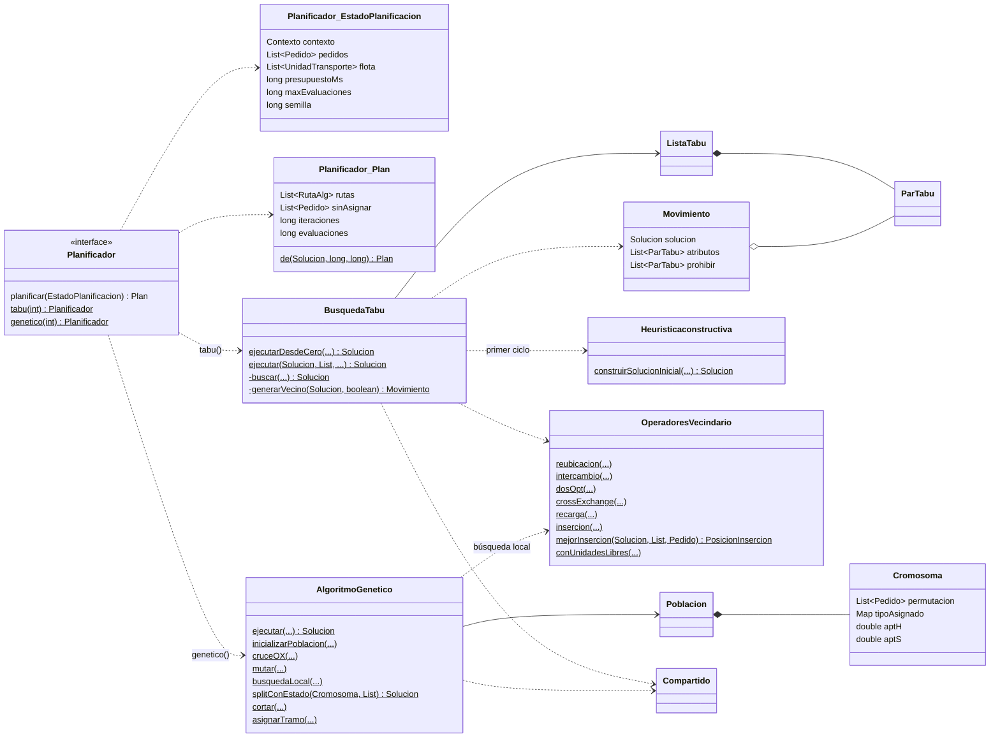
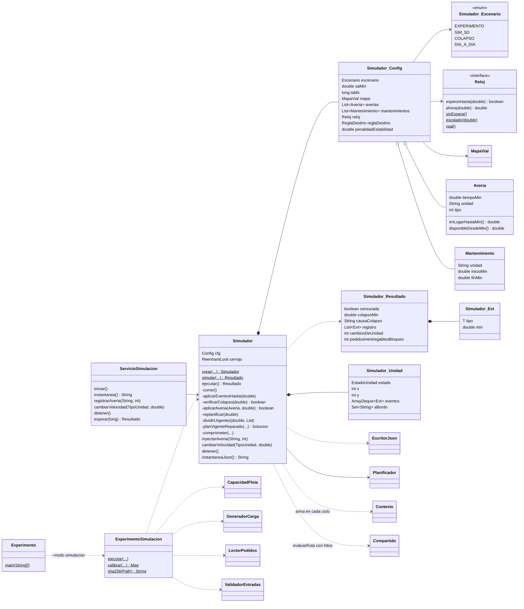

# Diagrama de clases (a partir del código real)

Clases del paquete `pe.edu.pucp.gamesoft.paqrap` a fin de la semana 08. Solo aparecen los atributos y métodos necesarios para entender la estructura; los nombres son los del código. Las clases anidadas usan la notación `Externa_Interna` porque Mermaid no admite el punto.

## 1. Modelo y evaluación

## 2. Algoritmos y planificador

## 3. Simulador, experimento e integración

**Notas**
- `Contexto` guarda el contexto activo por hilo (`ThreadLocal`). Sin contexto explícito, el contexto por defecto reproduce el modelo simple que usan `Main` y el modo estático.
- `Compartido` es la **única** función objetivo: la usan ambos algoritmos y el simulador. Así la comparación Tabú vs AG es justa.
- `ServicioSimulacion` y `EscritorJson` son la capa de integración, independiente de la tecnología web (Etapa 21).
