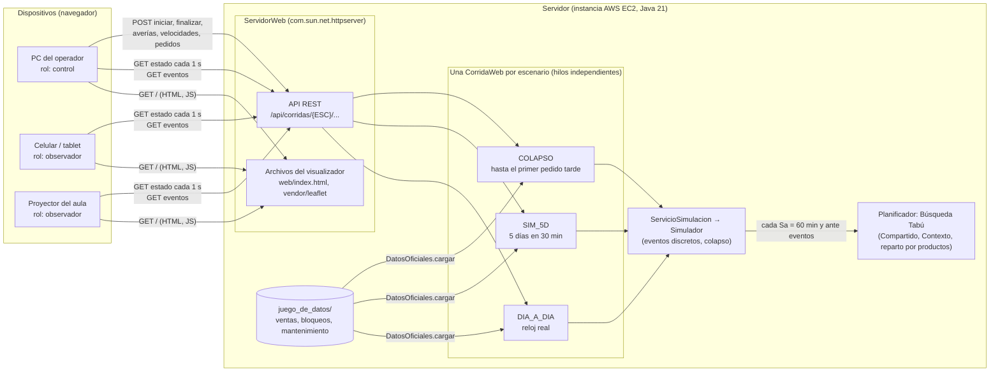
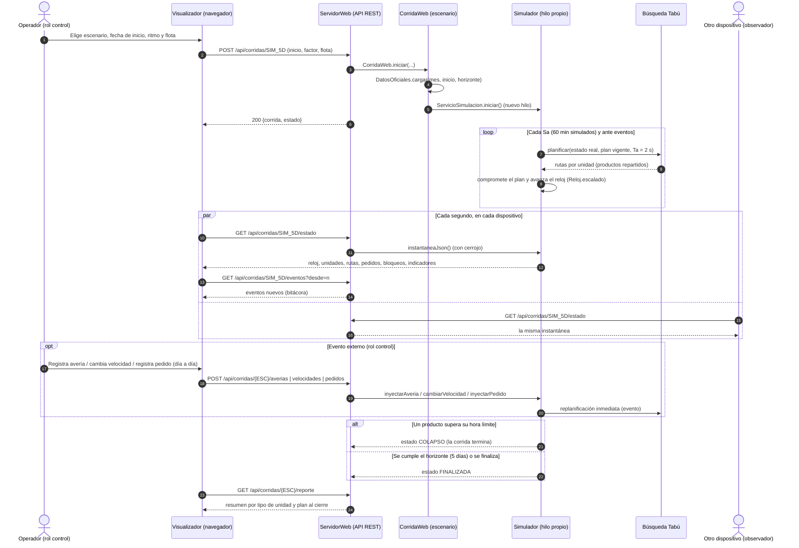

# Interacción entre el Planificador y el Visualizador (etapa 32)

La solución integrada tiene **dos componentes** que se comunican **solo por una API HTTP**:

- **Planificador** (Java, `ServidorWeb`): carga los datos oficiales, simula y planifica con Búsqueda Tabú. Corre una simulación por escenario, en su propio hilo, y guarda el estado en memoria.
- **Visualizador** (HTML + JavaScript, `web/index.html`): dibuja el estado y envía comandos. **No simula nada**: todo lo que muestra viene del planificador.

Cualquier dispositivo con un navegador puede abrir el visualizador y ver cualquiera de los tres escenarios. Todos los dispositivos ven **la misma corrida**, porque el estado vive en el planificador.

## 1. Componentes y despliegue

## 2. Secuencia de una corrida

## 3. Contrato de la API

| Método y ruta | Datos | Respuesta |
|---|---|---|
| `GET /api/datos` | — | meses con datos oficiales (`desde`, `hasta`) |
| `GET /api/corridas` | — | estado de las tres corridas (para las pestañas) |
| `POST /api/corridas/{ESC}` | `inicio=aaaa-mm-ddThh:mm`, `inicio_ms`, `factor`, `autos`, `motos`, `bicicletas` | `{corrida, estado}`; 409 si ya hay una en ejecución |
| `GET /api/corridas/{ESC}/estado` | — | `{corrida, estado}`: la instantánea completa |
| `GET /api/corridas/{ESC}/eventos?desde=n` | — | `{total, eventos[]}` desde el evento n |
| `GET /api/corridas/{ESC}/reporte` | — | resumen por tipo de unidad y plan vigente |
| `POST /api/corridas/{ESC}/finalizacion` | — | detiene la corrida |
| `POST /api/corridas/{ESC}/averias` | `unidad`, `tipo` (1, 2 o 3) | avería en el instante actual |
| `POST /api/corridas/{ESC}/velocidades` | `tipo`, `kmh` | rige desde la siguiente replanificación |
| `POST /api/corridas/DIA_A_DIA/pedidos` | `cliente`, `x`, `y`, `cantidad`, `plazo` | `{id, registro_min, limite_min}` |

`{ESC}` es `SIM_5D`, `COLAPSO` o `DIA_A_DIA`. Los datos de entrada van como formulario (`application/x-www-form-urlencoded`) y las respuestas son JSON. La API permite CORS, así que el visualizador también puede alojarse en otro dominio (`index.html?api=https://servidor`).

## 4. Decisiones de diseño

- **Consulta periódica (1 s) en lugar de WebSocket** (opción B de `docs/propuesta_arquitectura_integracion.md`): es lo más simple de construir y explicar, funciona detrás de cualquier proxy y no necesita librerías. La instantánea es completa, no incremental, así que un dispositivo que se conecta tarde ve todo en el siguiente segundo.
- **El visualizador interpola** el movimiento de las unidades a lo largo de su camino entre dos instantáneas, para que se vea fluido.
- **Un hilo por escenario:** desde la etapa 24 los algoritmos no tienen estado estático, así que las tres corridas pueden ir a la vez en el mismo proceso.
- **Rol de control u observador:** cualquier dispositivo puede mirar; solo el que tiene el rol de control muestra los botones de comandos. Para esta entrega el rol se elige en el navegador, sin autenticación.
