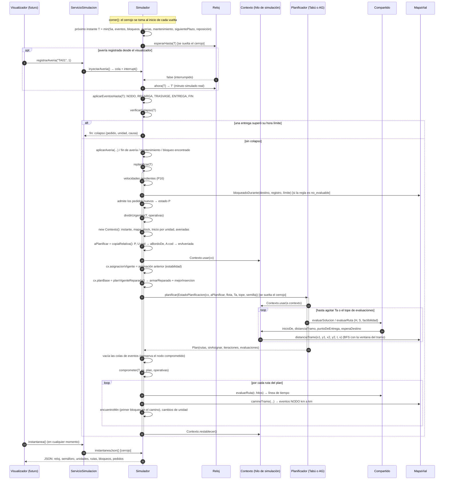

# Diagrama de secuencia: un ciclo de replanificación

Sale del código de `Simulador.correr()` y `Simulador.replanificar(t)` (semana 08). El ciclo se dispara por el periodo Sa (60 min) o por un evento: una avería, del archivo o externa; un bloqueo encontrado en el camino; el fin de una avería o de un mantenimiento.

**Puntos que conviene poder explicar**
1. El planificador **nunca** ve el estado absoluto: recibe copias relativas al instante T (`copiaRelativa`) y un `Contexto` con el punto y la hora desde los que cada unidad puede empezar.
2. Una unidad en viaje queda **comprometida** hasta el siguiente nodo: su `Inicio` es ese nodo, y el evento NODO se vuelve a encolar después de planificar.
3. Ambos algoritmos parten del plan vigente reparado (`cx.planBase`). El AG además garantiza no devolver algo peor que ese plan.
4. El cerrojo se suelta durante la espera del reloj y durante la llamada al planificador. Por eso la instantánea puede leerse mientras se planifica.
5. El cambio de velocidad solo se aplica al inicio de `replanificar`. Así no cambia a mitad de una línea de tiempo ya comprometida (P16).
